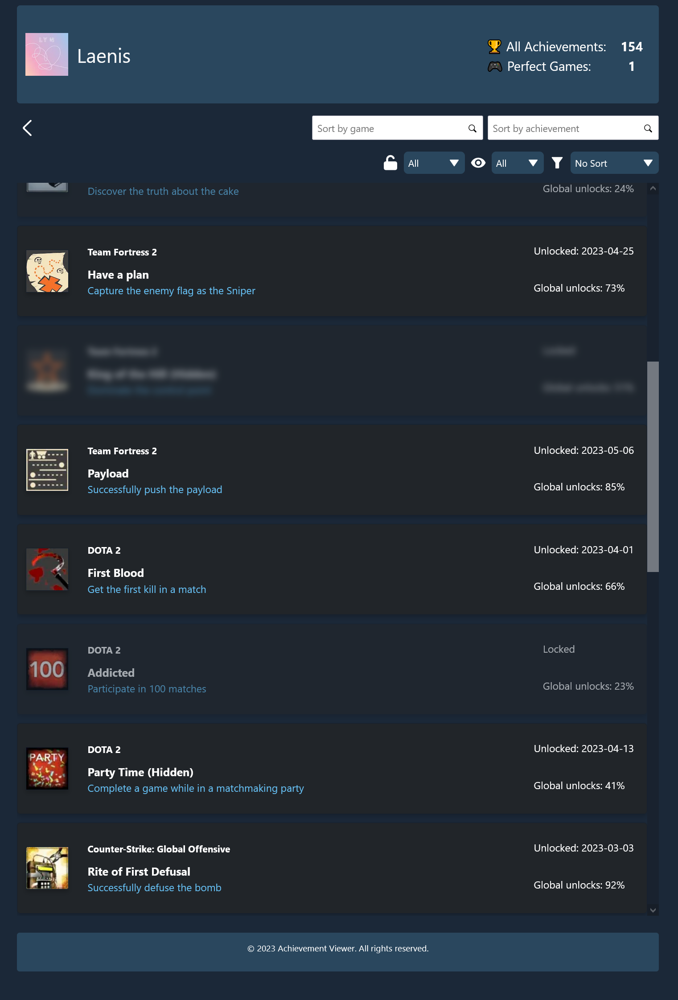

# 🏆 Achievement Viewer 🏆

## Description

Achievement Viewer is a Next.js based web application that allows users to track their video game achievements. It displays a list of owned games, as well as the achievements the user has unlocked for each game. The application also provides filters and sorting mechanisms to facilitate the search for specific achievements.

This is primarily a demo project to showcase a front-end achievement environment. It is not intended to be a fully functional full-stack application as it is missing a back-end database and user authentication. However, it does simulate a full environment by storing data in a dummy-data.js file, fetching data and populating elements within React components. The data works as the backbone of the application and is used to populate the main view, as well as the filters and sorting mechanisms.

### Idea and motivation

The initial goal of this project was to create a prototype focused on interaction and UI design using tools suchs as Figma, Adobe XD or Sketch.

However, we decided to take it a step further and create a functional front end web application that would allow us to showcase the prototype with full functionality instead of just static images and mockups. This would allow us to demonstrate the application's UI and interaction far more effectively.

## 🖥️ Access the web application

The application is hosted on Vercel and can be accessed at the following URL:

[https://achievement-viewer.vercel.app/](https://achievement-viewer.vercel.app/)

## 📑 Features

- Display a list of owned games with their achievements & stats.
- Filter and search for achievements based on game name, achievement status (locked/unlocked), visibility, and more.
- Sort achievements based on global unlocks and unlock dates.
- Color-coded completion percentages to visually show progress on the main view.
- Responsive design for mobile and desktop. Tested on multiple device-sizes.
- Steam-like UI design.
- You can add your own data to the dummy-data.js file to test the application with different parameters and data.

## 🧰 Installation and development setup

1. **Clone the repository:**

```git clone https://github.com/Mi3kka/achievement-viewer.git```

2. **Install Node.js and npm if you don't have them already:**

[https://nodejs.org/en/](https://nodejs.org/en/)

This app works best with Node.js version 18.16.0.

3. **Install dependencies:**

```npm install```

4. **Run the development server:**

```npm run dev```

5. **Open [http://localhost:3000](http://localhost:3000) with your browser to see the result.**

Development should be done on a feature branch. Once the feature is complete, create a pull request to merge the feature branch into the main branch.

## Technologies used

- [React](https://reactjs.org/)
- [Next.js (React framework)](https://nextjs.org/)
- [CSS (for global styling)](https://developer.mozilla.org/en-US/docs/Web/CSS)
- [Bootstrap (for some inline styling)](https://getbootstrap.com/)
- [Node.js & npm](https://nodejs.org/en/)
- [Eslint (for code linting)](https://eslint.org/)
- [Prettier (for code formatting)](https://prettier.io/)
- [Vercel (for hosting)](https://vercel.com/)

## 📂 Project Structure

This application is organized into the following directories:

- 🚀 **/app**: Contains the login page and initial landing page that users see when they load the web application. The login page is not functional, but it serves to simulate a potential authentication flow. This directory also contains footers, which are used across all pages of the application. Routes to the `MainView` component.

- 📄 **/pages**: Contains the `MainView` component, which forms the core of the application. This directory can be expanded with additional pages as needed. Currently we retain the main view and simply change component states when the user interacts with the UI.

- 🛠️ **/src/components**: This directory is home to the React components that build the application's UI. Components such as the `AchievementContainer` and the `AchievementCard` are housed here.

- 🧩 **/dummy-data**: Contains the `GameData.js` file, which is used to populate the application with game and achievement data.

- 🖼️ **/public**: This directory contains subdirectories for images and icons used throughout the application.

- 🎨 **/styles**: Contains CSS files used for styling the application, providing a custom aesthetic beyond Bootstrap's inline styles.

## Documentation

Please read the [documentation file](docs/documentation.md) in the docs directory for more information on the application's design and implementation.

Of course, there are also several comments throughout the code that explain the functionality of the application in more detail.

## Future suggestions

- Add a back-end database to store user data (e.g. MongoDB)
- Add user authentication along with Steam and other platforms, which store game achievements (e.g. Xbox, PlayStation, etc.)

## Credits
- **Anniina Talja**: UI & UX design, mockup, data modeling, and testing. Uses this web application in her thesis.
- **Julius Virtanen**: Implementation of the front end application, routing, state management, data flow and testing. Also wrote documentation.
- **Valve**: Inspiration for the UI design.

## Screenshots

Here are some screenshots of the application in action:

Main application view:


Achievement view:


Mobile view:


## License

[MIT](https://choosealicense.com/licenses/mit/)